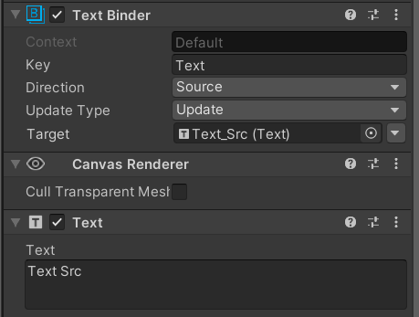
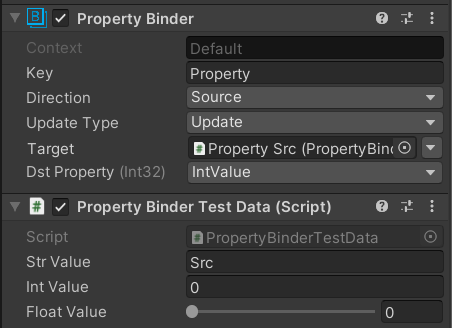

<div align="left">    

</div>

# UBind
**UBind** 是一个适用于 Unity 的数值绑定组件，用于快速实现UI和逻辑数据的关联绑定。


[](https://openupm.com/packages/com.ls9512.ubind/)
 
 


[](https://996.icu)

[](https://github.com/ls9512/UBind/issues)
[](https://github.com/ls9512/UBind/pulls)
[](https://github.com/ls9512/UBind)

[[中文文档]](README_CN.md)

<!-- vscode-markdown-toc -->
* 1. [特性](#)
* 2. [使用方法](#-1)
	* 2.1. [组件方式](#-1)
		* 2.1.1. [常用组件绑定器](#-1)
		* 2.1.2. [属性绑定器](#-1)
		* 2.1.3. [类型绑定器](#-1)
	* 2.2. [代码方式](#-1)
		* 2.2.1. [Monobehaviour 自动绑定](#Monobehaviour)
		* 2.2.2. [MonoBehaviour 手动绑定](#MonoBehaviour)
		* 2.2.3. [手动绑定任意对象](#-1)
* 3. [内建类型](#-1)
	* 3.1. [Attribute](#Attribute)
		* 3.1.1. [Bind Value Attribute](#BindValueAttribute)
		* 3.1.2. [Bind Type Attribute](#BindTypeAttribute)
	* 3.2. [Data Context](#DataContext)
	* 3.3. [Data Binder](#DataBinder)
	* 3.4. [Data Converter](#DataConverter)
	* 3.5. [Component Binder](#ComponentBinder)
		* 3.5.1. [Component Update Binder](#ComponentUpdateBinder)
		* 3.5.2. [Component Trigger Binder](#ComponentTriggerBinder)
	* 3.6. [Runtime Data Binder](#RuntimeDataBinder)
* 4. [内建组件](#-1)
* 5. [自定义扩展](#-1)
	* 5.1. [Custom Data Binder](#CustomDataBinder)
	* 5.2. [Custom Component Binder](#CustomComponentBinder)
	* 5.3. [Custom Binder Editor](#CustomBinderEditor)
	* 5.4. [Custom Data Converter](#CustomDataConverter)
* 6. [注意事项](#-1)
* 7. [扩展 -- TextMeshPro](#--TextMeshPro)

<!-- vscode-markdown-toc-config
	numbering=true
	autoSave=true
	/vscode-markdown-toc-config -->
<!-- /vscode-markdown-toc -->

***

##  1. <a name=''></a>特性
* 支持双向绑定
* 支持多数据源和多目标对象
* 支持任意组件的任意属性和字段绑定
* 支持数据源和目标数据类型不同时的自动类型转换
* 提供大量内置组件的常用属性绑定器
* 任意运行时对象的属性和字段绑定
* 提供数据容器以按组划分数据使用域
* 可扩展自定义数据绑定器、自定义类型转换器

***

##  2. <a name='-1'></a>使用方法
###  2.1. <a name='-1'></a>组件方式
####  2.1.1. <a name='-1'></a>常用组件绑定器
可以使用内置的绑定器组件直接将常见UI组件的属性设置成数据源或者数据目标，具体可用组件参考 [内建组件](#-1)：


####  2.1.2. <a name='-1'></a>属性绑定器
如果需要操作自定义组件，或者未内置提供专用绑定器的组件，则可以使用更为通用的 **PropertyBinder**，简单设置即可绑定任意组件的任意属性字段：


####  2.1.3. <a name='-1'></a>类型绑定器
如果需要将一个数据类绑定到对应的UI，则只需要使用 **TypeBinder**，指定数据类的程序集和类名，然后将对应属性字段与UI依次绑定，然后在提供数据的逻辑代码中，编码绑定数据源即可：
``` cs
public class UBindSamplePlayerData
{
    public string Name;
    public int Exp;
    public float Stat;
    public float PlayTime;
}
```


``` cs
public class UBindSampleGameManager
{
    public UBindSamplePlayerData Player;

    public void Awake()
    {
        Player = new UBindSamplePlayerData() {Name = "Player",};
        UBind.BindSource("PlayerData", Player);
    }
}
```
###  2.2. <a name='-1'></a>代码方式
####  2.2.1. <a name='Monobehaviour'></a>Monobehaviour 自动绑定
通过继承 **BindableMonoBehaviour** 获得自动处理属性和字段绑定、解绑的能力。
使用 **BindValue** Attribute 来标记需要绑定基础类型数据：
``` cs
public class ExampleMonoBehaviour : BindableMonoBehaviour
{
	[BindValueSource("ValueKey")]
	public string ValueSource;

	[BindValueTarget("ValueKey")]
	public string ValueTarget;
}
```
使用 **BindType** Attribute 来标记需要绑定类和结构体数据：
``` cs
public class ExampleData
{
	public string Value;
}

public class ExanokeMonoBehaviour : BindableMonoBehaviour
{
	[BindTypeSource("TypeKey")]
	public ExampleData DataSource;

	[BindTypeTarget("TypeKey")]
	public ExampleData DataTarget;
}
```
####  2.2.2. <a name='MonoBehaviour'></a>MonoBehaviour 手动绑定
对于无法使用继承的自定义 **Monobehaviour** 对象，可以在 **OnEnable / OnDisable**方法中添加如下代码，手动调用 **BindMap** 的绑定和解绑接口，可以获得和自动绑定一样的效果：
``` cs
public class ExanokeMonoBehaviour : MonoBehaviour
{
	[BindValueSource("ValueKey")]
	public string ValueSource;

	[BindValueTarget("ValueKey")]
	public string ValueTarget;

	public void OnEnable()
	{
		BindMap.Bind(this);
	}

	public void OnDisable()
	{
		BindMap.UnBind(this);
	}
}
```
####  2.2.3. <a name='-1'></a>手动绑定任意对象
通过调用 **UBind** 的多种重载接口，可以实现对运行时的数值、属性、字段、类对象、结构体对象进行绑定，如果需要在特定时间进行绑定和解绑操作，则需要自行缓存返回的 **DataBinder** 对象：
``` cs
public class ExampleData
{
	public string Value;
}

public class ExampleClass
{
	public string ValueSource;
	public string ValueTarget;

	public ExampleData TypeSource;
	public ExampleData TypeTarget;

	private DataBinder _runtimeValueSourceBinder;
	private DataBinder _runtimeValueTargetBinder;

	private DataBinder _runtimeTypeSourceBinder;
	private DataBinder _runtimeTypeTargetBinder;

	public void BindTest()
	{
		_runtimeValueSourceBinder = UBind.BindSource<string>("ValueKey", () => ValueSource);
		_runtimeValueTargetBinder = UBind.BindTarget<string>("ValueKey", value => ValueTarget = value);

		_runtimeTypeSourceBinder = UBind.BindSource("TypeKey", TypeSource);
		_runtimeTypeTargetBinder = UBind.BindTarget("TypeKey", TypeTarget);
	}

	public void UnBindTest()
	{
		_runtimeValueSourceBinder.UnBind();
		_runtimeValueTargetBinder.UnBind();

		_runtimeTypeSourceBinder.UnBind();
		_runtimeTypeTargetBinder.UnBind();
	}
}
```
需要注意的是，在以上的例子中，数据源和数据目标各生成了一个绑定器，这是默认并且推荐的使用方式，以便于支持多数据源、多数据目标。但是数值类的绑定 (**RuntimeValueBinder\<T\>**) 也可以使用下面的方式简化调用，会同时返回数据源绑定器和数据目标绑定器：
``` cs
public class ExampleClass
{
	public string Source;
	public string Target;

	private DataBinder _sourceBinder;
	private DataBinder _targetBinder;

	public void BindTest()
	{
		(_sourceBinder, _targetBinder) = UBind.Bind<string>("Key", () => Source, value => Target = value);
	}

	public void UnBindTest()
	{
		_sourceBinder.UnBind();
		_targetBinder.UnBind();
	}
}
```

***

##  3. <a name='-1'></a>内建类型
###  3.1. <a name='Attribute'></a>Attribute
####  3.1.1. <a name='BindValueAttribute'></a>Bind Value Attribute
用于在拥有处理绑定关系能力的类中标记需要绑定的属性和字段，只推荐绑定常见基础数据类型。被标记对象会动态创建 **RuntimeValueBinder** 进行处理。
####  3.1.2. <a name='BindTypeAttribute'></a>Bind Type Attribute
与 **BindValueAttribute** 的不同，用于标记自定义类和结构体类型对象，会动态创建 **RuntimeTypeBinder** 进行处理。
###  3.2. <a name='DataContext'></a>Data Context
数据容器，用于维护一组 Data Binder，可以包含多个数据源和数据目标点。每个数据容器相互独立。

###  3.3. <a name='DataBinder'></a>Data Binder
数据绑定器，用于将数据与具体的对象和其属性进行绑定，可以用于接收和广播数据。
|属性|描述|
|-|-|
|Context|数据容器的 Key 值，默认为 Default，无特殊需求可保持默认不设置。|
|Key|目标数据的 Key 值，是单个数据容器内数据的唯一标识。|
|Direction|数据的传递方向，Source 标识当前绑定器是数据源，作为数据广播发送者，Destination 标识当前绑定器作为数据接收者。|

###  3.4. <a name='DataConverter'></a>Data Converter
当数据源和数据目标的数据类型不同时，会使用与 **(sourceType, targetType)** 对应的数据转换器尝试转换。

默认的转换器 **CommonConverter** 的实现如下，可以通过修改 **DataConverter.Default** 来替换：
``` cs
Convert.ChangeType(object 0data, Type type);
```
可以按需要使用以下接口提前注册特定类型的自定义转换器：
``` cs
DataConvert.Register(Type sourceType, Type targetType, DataConverter dataConverter);
```

###  3.5. <a name='ComponentBinder'></a>Component Binder
数据绑定器的 Unity Component 版本，需要与一个具体的绑定器实现泛型绑定，用于实现组件数据的绑定。
|属性|描述|
|-|-|
|Update|对于未提供数据变化回调的目标对象，数据采用 Update 模式检测变化是否发生，此时需要指定 Update 的时机。|
|Target|数据来源对象，可以是当前节点或是子节点中的组件。|

####  3.5.1. <a name='ComponentUpdateBinder'></a>Component Update Binder
目标组件本身未提供数值变动的回调，在不修改组件代码的前提下，需要依赖 Update 来检测数值变化的绑定器基类。

####  3.5.2. <a name='ComponentTriggerBinder'></a>Component Trigger Binder
目标组件提供了诸如 `OnValueChanged()` 等数值变动的回调方法，则可以使用触发模式的绑定器基类，应当尽可能使用这种方式以优化性能。

###  3.6. <a name='RuntimeDataBinder'></a>Runtime Data Binder

***


##  4. <a name='-1'></a>内建组件
|组件|绑定对象类型|默认绑定属性|绑定属性类型|
|-|-|-|-|
|Text Binder|Text|text|string|
|Text FontSize Binder|Text|fontSize|int|
|InputField Binder|InputField|text|string|
|Slider Binder|Slider|value|float|
|Scrollbar Binder|Scrollbar|value|float|
|Dropdown Binder|Dropdown|value|int|
|CanvasGroup Binder|CanvasGroup|alpha|float|
|Toggle Binder|Toggle|value|bool|
|Color Binder|Graphic|color|Color|
|Image Binder|Image|sprite|Sprite|
|Image FillAmount Binder|Image|fillAmount|float|
|RawImage Binder|RawImage|texture|Texture|
|Property Binder|Component|||
|Type Binder|Component||

***

##  5. <a name='-1'></a>自定义扩展
###  5.1. <a name='CustomDataBinder'></a>Custom Data Binder
通过继承 **DataBinder** 实现一个特定对象和属性的运行时数据绑定器：
``` cs
public class RuntimeImageFillAmountBinder : DataBinder<Image, float>
{
	public override void SetData(float data)
	{
		Target.fillAmount = data;
	}

	public override float GetData()
	{
		return Target.fillAmount;
	}
}
```

###  5.2. <a name='CustomComponentBinder'></a>Custom Component Binder
如果需要用作组件，则需要额外实现对应的 **ComponentBinder**：
``` cs
[AddComponentMenu("Data Binding/Image FillAmount Binder")]
public class ImageFillAmountBinder : ComponentUpdateBinder<Image, float, RuntimeImageFillAmountBinder>
{
}
```

###  5.3. <a name='CustomBinderEditor'></a>Custom Binder Editor
如果组件需要保持基础组件样式并且扩展自定义属性和样式，则需要实现对应的 **ComponentBinderEditor**，与绑定器组件和运行时绑定器泛型关联：
``` cs
#if UNITY_EDITOR
using UnityEditor;

[CustomEditor(typeof(ImageFillAmountBinder)), UnityEditor.CanEditMultipleObjects]
public class ImageFillAmountBinderEditor : ComponentBinderEditor<Image, float, RuntimeImageFillAmountBinder>
{
}
#endif
```

###  5.4. <a name='CustomDataConverter'></a>Custom Data Converter
如果需要在传递不同数据类型，并且数据不是 **Convert.ChangeType()** 可以处理的，则需要实现该类型转换的自定义数据转换器：
``` cs
public class CustomDataConverter : DataConverter
{
	public object To(object data, Type targetType)
	{
		object result;
		// To do something...
		return result;
	}
}
```
需要使用这些绑定器之前，比如游戏初始化时，注册自定的绑定器：
``` cs
var sourcetType = sourceData.GetType();
var targetType = targetData.GetType();
DataConverter.Register((sourceType, targetType), new CustomDataConverter());
```

***

##  6. <a name='-1'></a>注意事项
* OnValueChanged 仅数据源可用。
* 所有参数必须在编辑器模式配置，运行时修改参数无效。
* TypeBinder 暂时仅支持单一层级属性的简单数据类。
* 尽管组件支持不同数据类型的自动转换，但任然建议直接传递相同的数据类型以优化性能。
* 多个数据源之间的数据不会被同步，如果数据源之间也需要同步需要将 Direction 设置成 Both。
* PropertyBinder 和 TypeBinder 依赖反射实现，但由于某些原生组件的属性封装，直接反射修改字段并不能刷新显示，可能需要操作对应的属性，或者定制专用绑定器。

***

##  7. <a name='--TextMeshPro'></a>扩展 -- TextMeshPro
* TMP Text Binder
* TMP Text UI Binder
* TMP Input Field Binder